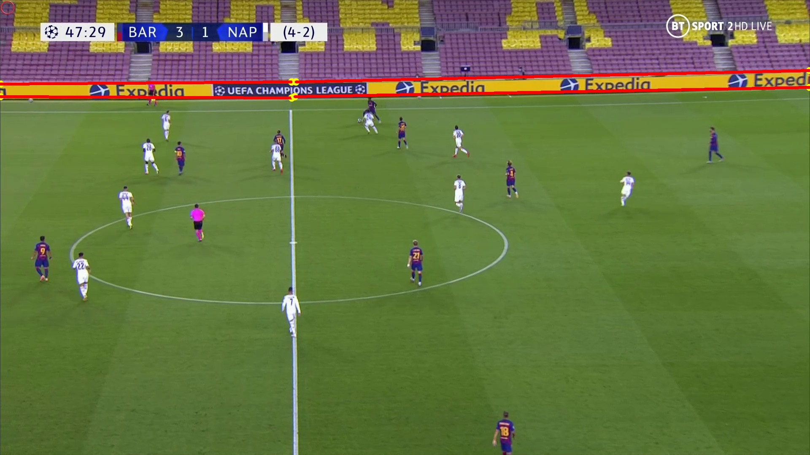

# Line Detection Dataset

## General Info


We have used [L-CNN — End-to-End Wireframe Parsing Network](https://arxiv.org/abs/1905.03246) to identify the lines surrounding advertisement billboards. L-CNN is a very effective neural network for detecting wireframes from an input image.

## Dataset Description

In this project, we have prepared a dataset of lines present in a soccer match screen, these lines are drawn around the advertisement billboards.
The dataset consists of different scene images with their corresponding labels. There are more than 700 images with a JSON file containing the labels for both training and validation data. For each image, there exists a dictionary containing the file name, image size, and the starting and ending points of each line.

A sample image with its corresponding labels is shown below **(Figure 1)**.

<p align="center">
    <br/>
	 Figure 1. Sample of Line Detection Dataset
</p>


## Dataset Structure

Below is a overview of the Line Detection dataset.

```bash
data/                           # folder for Line Detection dataset
    images/                      
    train.json
        sample:[{"filename": "image_1.jpg", "lines": [[6, 280, 697, 250], [5, 281, 546, 252]], "height": 1080, "width": 1920}]
    validation.json                             
```
