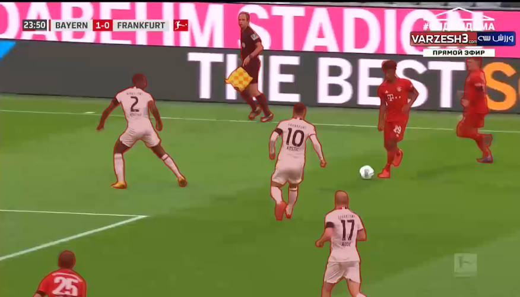
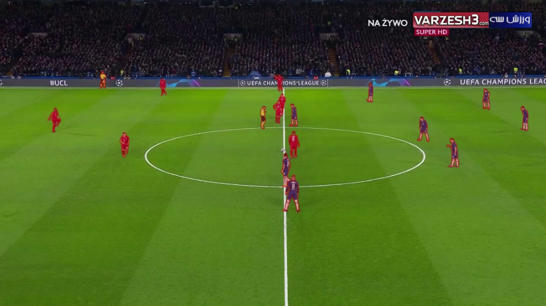

# Segmentation dataset

## Dataset Description

- In this project, a segmentation dataset has been prepared specifically for football. The purpose of collecting segmentation datasets is to provide basic data for training MASK R-CNN and DEEP LAB networks, which are part of segmentation networks. These networks are used to identify players and goals on the football field. After identifying the players and the goalS, this module is used in the virtual advertising section.
- Generally 600 photos were tagged by members with the tools available on hasty.ai, which was reduced to 500 photos after cleaning.

<p align="center">
    <br/>
	Figure 1. samples of segmentation dataset
</p>


<br/>

<p align="center">
    <br/>
	Figure 2. samples of segmentation dataset
</p>


<br/>

Starter code for the dataset can be found [here](https://github.com/FootballAnalysis/footballanalysis/tree/main/Virtual%20advertisingg). In addition to training code, you will also find python scripts for evaluating standard metrics for comparisons between models.


## Dataset Structure

Below is a overview of the segmentation dataset.


```bash
SD___Dataset.zip
    |
    |── Annotation          (Annotation Files) 
    |     ├── train
    |      |
    |     └── validation
    |
    |── Masks               (Mask images) 
    |    ├── train
    |    |
    |    └── validation
    |
    └── Images               (Original images)      
         ├── train
         |
         └── validation                 
```


