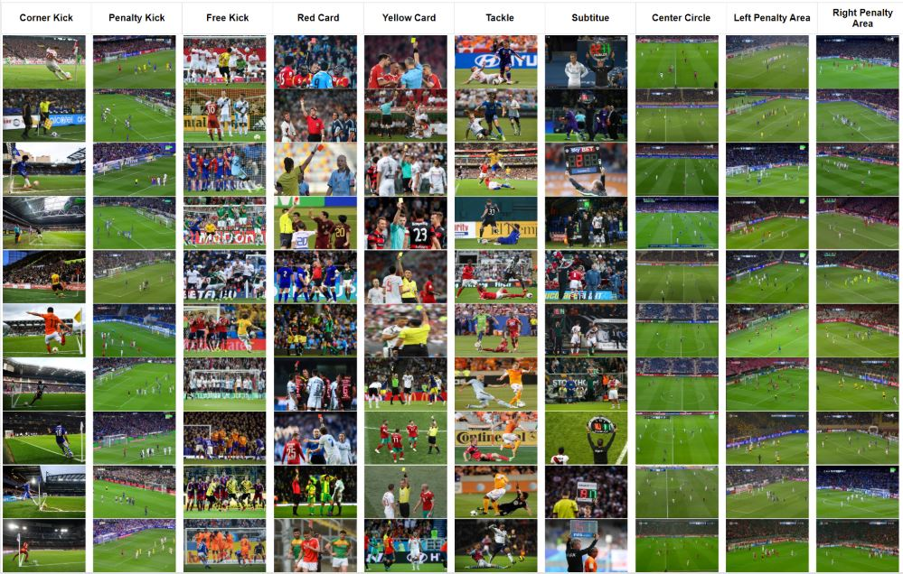
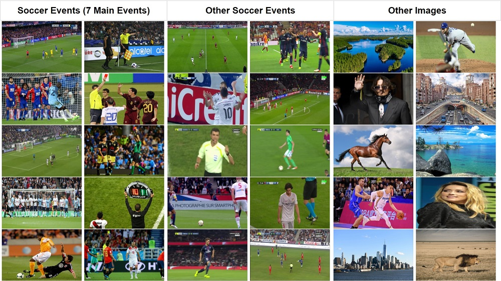
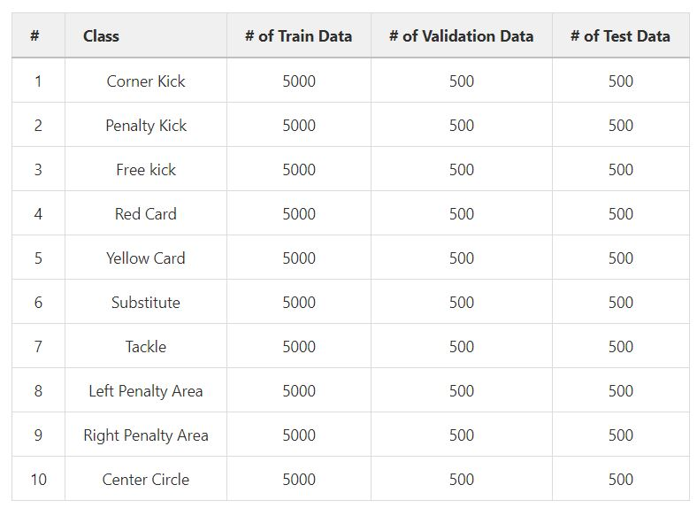
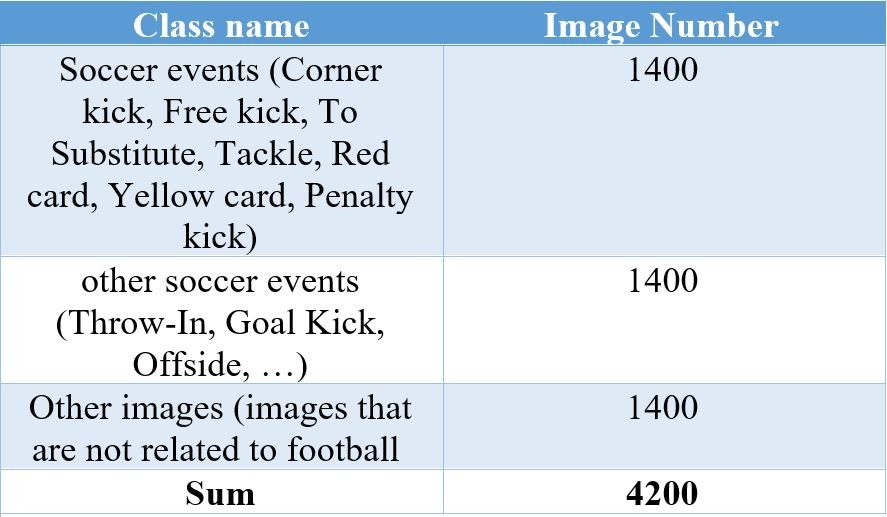

# Soccer Event Dataset (Image)

## Dataset Description


In the present project, two image datasets of a football match were collected: 
1. the Soccer Event (SEV) dataset covering the football match events
2. the Test Event dataset used to assess the proposed architecture 

The aforementioned datasets were collected in two ways:

1. Web crawling and collection of images related to events
2. Watching the videos of UCL and European league football matches to extract the relevant frames.


The SEV dataset covered 7 football match events and 3 scenes from the football field. The seven main events include:
- **Corner Kick**
- **Penalty Kick**
- **Free Kick**
- **Red Card**
- **Yellow Card**
- **Tackle**
- **substitute**

The scenes from the football field included:
- **Left Penalty Area**
- **Right Penalty Area**
- **Center Circle**


<p align="center">
    <br/>
	Figure 1. Samples of soccer event dataset
</p>

<br/>

The Test Event dataset is used to test the event detection network. This dataset consists of 3 classes:

1. Images of selected events in the SEV database (a total of 200 images were extracted from 7 events)
2. Football match images that don’t fall within the category of the 7 events.
3. Other Images (Nature,Car,....)

<br/>
<p align="center">
    <br/>
	Figure 2. Samples of test event dataset
</p>


<br/>
<br/>


# Dataset Statistics


- The Soccer event dataset consists of 60000 images from 10 different events, each of which includes 6000 images.
- In each category, 5000 images are used as the training data, 500 images are used as validation data and 500 images are used as test data

<br/>
<p align="center">
    <br/>
	Table 1. Soccer Event Dataset
</p>


<br/>

- The Test Event dataset includes 4,200 images falling within 3 classes. This dataset is described in detail in table (2) 
<br/>
<p align="center">
    <br/>
	Table 2. Test Event Dataset
</p>


## Dataset Structure

Below is a overview of the soccer event dataset.

```bash
SEV___Dataset.zip
    |
    |── Train (directories of Events names)
    |     ├── Penaly Kick
    |     |
    |     |── Free Kick
    |     |
    |     └── .....   
    └── Test (directories of Events names)
          ├── Penaly Kick
          |
          |── Free Kick
          |
          └── .....                          
```

## How to download dataset


You can download the dataset from [here](https://drive.google.com/drive/folders/1jzt7g0KqFNTshEAau95aScPWin55g31E?usp=sharing)


# Citation

When using this dataset in your research, please cite us:

```
@article{karimi2021soccer,
  title={Soccer Event Detection Using Deep Learning},
  author={Karimi, Ali and Toosi, Ramin and Akhaee, Mohammad Ali},
  journal={arXiv preprint arXiv:2102.04331},
  year={2021}
}
```

