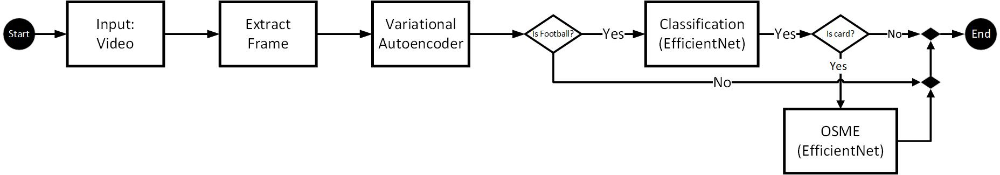
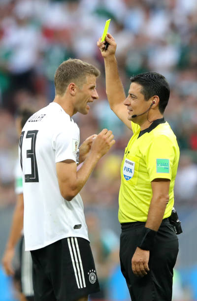

# Event Dataset (Image Based)

## General Info

Using this module, you can process a full video of a soccer match, obtaining all of the events that occurred in the match. The input could be a soccer match with any time duration, while the output, after processing and distinguishing events, is a tagged video, in which the events occurred at any time will be highlighted by a tag on the video.
This service currently could distinguish seven events as follows (more events will be added as soon as possible):


- Penalty Kick
- Free Kick
- Corner Kick
- Red Card
- Yellow Card
- Tackle
- Substitute


<p align="center">
    <br/>
	Figure 1. Proposed algorithm 
</p>


<br/>

This module has been implemented using Neural Networks. The proposed algorithm of this network is presented in fig (1). 
our work has some improvements and advantages as below:
- using of the new architecture for image classification
- using the Fine-grained architecture and solving the problems related to yellow and red card classification
- Improving the recognition of No Highlights images and event images using 3 methods
1. using of VAE.
2. Setting a Threshold in the Classification Network.
3. Using 3 image classes in image classification module to ensure that the event images are not mistakenly assigned to the classes related to these events.

- Using our new [Soccer event dataset](https://github.com/FootballAnalysis/footballanalysis/tree/main/Dataset/Soccer%20Event%20Dataset%20(Image)).


## Demo Application (As soon as possible we release trained-models in our repository)

If you want to train networks from scratch, Please Skip this section and go to the Training section.

To deploy the demo, run the following commands:
- Download Code Folder
- change directory to Event Detection Module Repository.
- Install Python dependencies: `pip install -r requirements.txt`
- Put your football into "video/input/" directory.
- Run the demo: `python event_demo.py `

The results will be saved in "video/output/" directory.

## Training (As soon as possible we release codes in our repository)

To train networks from scratch, run the following commands:
- Download Code Folder
- pip install tensorflow-gpu
- Run the code: `python3 train.py --dataset /data2/soccerdateset --save_directory modeloutput --epoch 8 --batchsize 32  --dims 112 --lr 1e-4 --num_train 50000 --num_validation 5000  --neuron 256 --gpu 0 `
- Other Codes in ipynb format


## Some Results

- sample of event detection :

<p align="center">
    <br/>
	Figure 2. sample input of event detection
</p>

<br/>

<p align="center">
    <br/>
	Figure 3. sample output of event detection
</p>


## Citation

When using this code in your research, please cite us:

```
@inproceedings{,
  title={},
  author={},
  booktitle={},
  year={}
}
```

