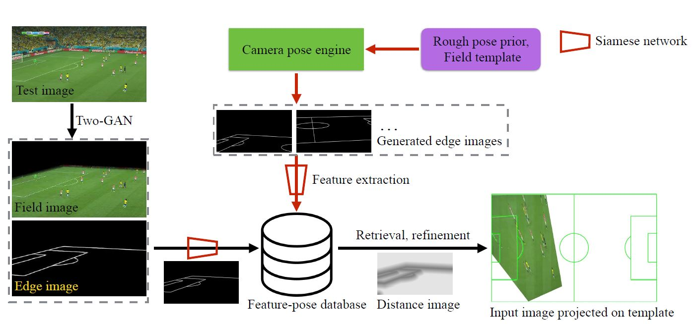
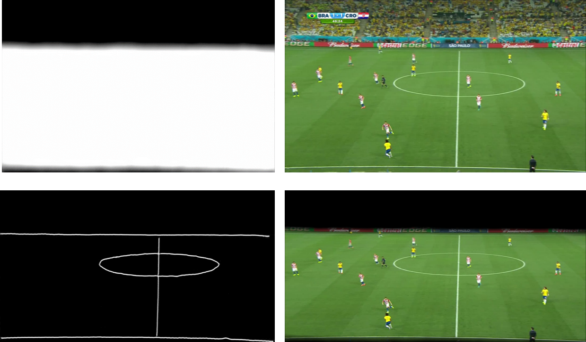
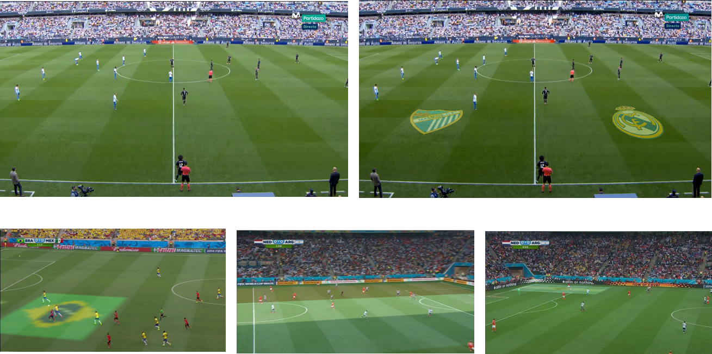

# Perspective transformation Module 

Transforming the view of football video frame into the top view is called Perspective transformation. The goal of Perspective transformation is to help coaches manage the team and control the performance of each player. This can be used in applications which some information about players is needed. For example: average speed of players or finding the best position which player can play his role. The input is a football video frame and the output is the top view transformed picture.
Some additional outputs also is generated which can be used for another applications. These are:
1.  The edge image of white lines in the field of stadium.
2.  The segmentation of field grass from other parts of field.

Perspective transformation Module  is a PyTorch implementation of  [Sports Camera Calibration via Synthetic Data](https://arxiv.org/abs/1810.10658) paper.
This is composed of three sub-modules:

1. A [pix2pix GAN](https://arxiv.org/abs/1611.07004) for segmenatation of grass field from other parts of stadium
2. A [pix2pix GAN](https://arxiv.org/abs/1611.07004) network for football field lines detection
3. A database of football field line images 
4. A [siamese](https://arxiv.org/pdf/1911.07702) network for single shot similarity evaluation  

## Algorithm
The architecture of algorithm can be displayed as below :

We follow this algorithm for test phase :
- First of all, we generate the edge images by two-GAN network (two pix2pix GANs concatenated).
- Then we extract some features related to each of the edge images. 
- Then by comparing with extracted features has been saved in the database in the training phase, we can find the most similar edge image in  the database.
- Finally, we can warp the football image into the top view by corresponding affine matrix has been saved in the database in the training phase.

Note that there are two types of features and so two corresponding databases :
1. deep features extracted from the last layer of siamese network.
2. HOG (Histogram Of Gradients) features.  

Number of HOG features are more than deep features. So for better speed of running in the test phase we use deep features but you can  change that in the demo code for yourself if you want!   

We also used affine matrix we found from database to advertise anything appropriate on the grass field.
You can find some of the results in the results section.

For more datils, please check [Sports Camera Calibration via Synthetic Data](https://arxiv.org/abs/1810.10658) paper
or their [github page](https://github.com/lood339/SCCvSD).

## Demo Application
If you want to train all three (two-GAN and Simaese) networks from scratch, Please Skip this section and go to the Training section in this page or read this [github page](https://github.com/lood339/SCCvSD) for more details!

To deploy the demo, run the following commands:
- Change directory to  Perspective transformation Module Repository.
- If you do not have PyTorch, please see [the website](http://pytorch.org).
- Install Python dependencies: `pip install -r requirements.txt`
- Download the trained model from [this link](https://drive.google.com/uc?export=download&id=15eBQRfiQgb-h2RK5hki0NJu10O7uXAz3) and put all 4 files in the `./python_codes/pytorch-two-GAN-master/checkpoints/soccer_seg_detection_pix2pix/ ` directory
- For a single image, Run the demo: `python demo_image.py --image [address of image what you want to test] --advertising_image [address of advertising image what you want to overlay ; This argument is not required] `
- For a video, Run the demo: `python demo_video.py --image [address of video what you want to test] --advertising_image [address of advertising image what you want to overlay ; This argument is not required]`

## Training

For training Two-GAN and siamese from scratch, you should read [this](https://github.com/lood339/SCCvSD). 
It also consists of database generation codes.

## Some results

 
