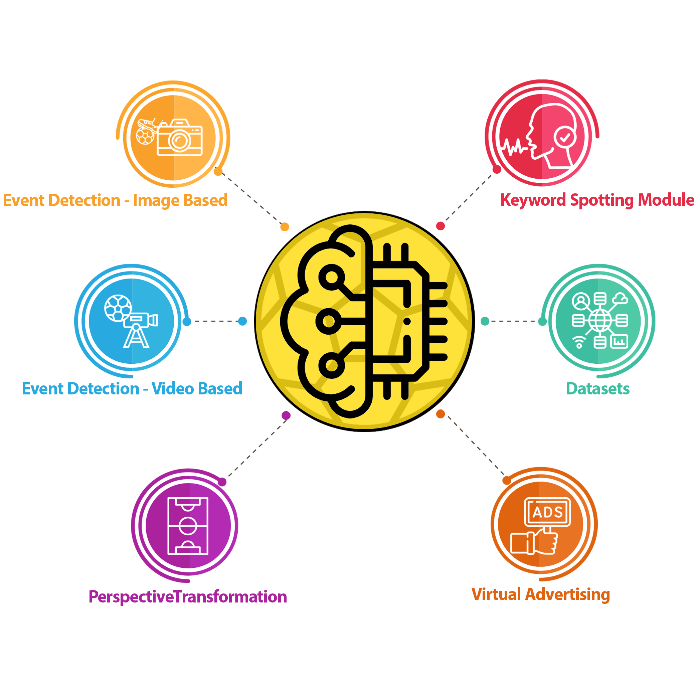
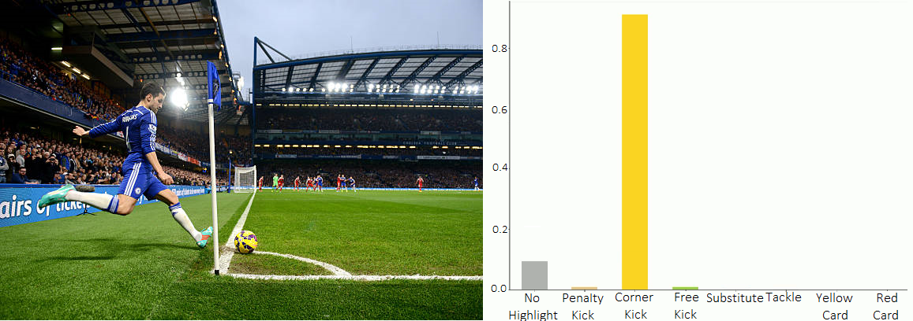
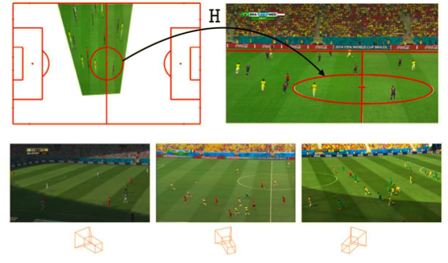
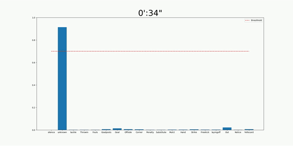
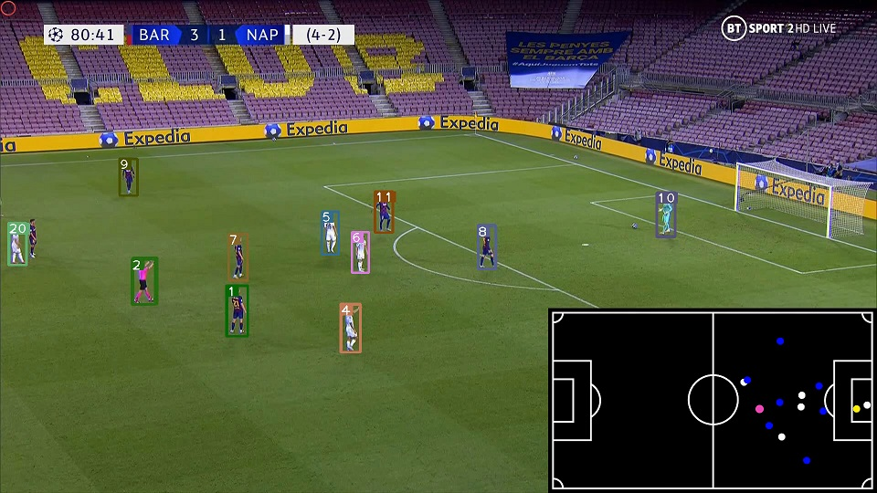

## Football Analysis

Our services contain a broad range of soccer data analysis from providing multimodal datasets (image, video and sounds) to advanced components such as event detection, virtual advertising and keyword spotting. visit our [website](https://footballanalysis.github.io/) for more information.

**Our main submodules are as below: (please click on each for more information)**
 
1. **[Event Detection (Image based)](https://gitlab.com/footballanalysis/FootballAnalysis/-/tree/master/Event%20Detection%20(Image%20Based))**: Using this module, you can process a full video of a soccer match, obtaining all of the events occurred in the match. The input could be a soccer match with any time duration, while the output, after processing and distinguishing events, is a tagged video, in which the events occurred on any time will be highlighted by a tag on the video.

     

<figure class="center">

<figcaption>Figure 1. sample output of event detection (image based) module</figcaption>
</figure>
  

2. **[Event Detection (Video based)](https://gitlab.com/footballanalysis/FootballAnalysis/-/tree/master/Event%20Detection%20(Video%20Based))**: Soccer event detection is a foundation of Soccer match analysis. Given the fact that soccer is one of the most popular sport in the world, we tried to detect and classify some of the most important events using soccer video clips which can be of interest of soccer technical analyzer. For this purpose, we created a new dataset containing various event categories and applied different deep learning model on them.

<figcaption>Figure 2. sample output of event detection (video based) module</figcaption>

  

3. **[Virtual Advertising](https://gitlab.com/footballanalysis/FootballAnalysis/-/tree/master/Virtual%20advertising)**: Showing and advertising your products or services in any Virtual environment is known as virtual advertising. This kind of advertisement can be done also in football videos by overlaying billboards placed around the field. Almost all existing related products do this by their hardware tools which are placed in the stadium but we tried to do that completely by a single software. 
By combining some modules of this work with the Perspective transformation module we also can advertise anything appropriate on the grass field.

<figcaption>Figure 3. sample output of Virtual Advertising module</figcaption>

  

4. **[Perspective Transformation](https://gitlab.com/footballanalysis/FootballAnalysis/-/tree/master/Perspective%20Transformation)**: Transforming the view of football video frame into the top view is called Perspective transformation. The goal of Perspective transformation is to help coaches manage the team and control the performance of each player. This can be used in applications which some information about players is needed. For example: average speed of players or finding the best position which player can play his role. The input is a football video frame and the output is the top view transformed picture.
Some additional outputs also is generated which can be used for another applications. These are: 1-The edge image of white lines in the field of stadium. 2-The segmentation of field grass from other parts of field.

<figcaption>Figure 4. sample output of Perspective Transformation module</figcaption>

  

5. **[Keyword Spotting]((https://gitlab.com/footballanalysis/FootballAnalysis/-/tree/master/Keyword%20Spotting))**: The primary purpose of developing a Keyword Spotting (KS) system is to detect important football events using the voice of a football reporter. This module helped Imaged and video-based event detection to achieve proper results. As shown in figure 4, the KSM result is a probability distribution of events that helps other modules to decide better in confusing situations. Also, with a threshold, this module can work individually. Therefore, this module can work as a module in any project or separately.

<figcaption>Figure 5. Output of Keyword Spotting Module (checkout more details and full video <a href="https://gitlab.com/footballanalysis/FootballAnalysis/-/tree/master/Keyword%20Spotting">Here</a>)</figcaption>

  

6. **[Bird's eye view]((https://gitlab.com/footballanalysis/FootballAnalysis/-/tree/master/Bird's%20eye%20view))**: Understanding the 3D layout of a scene from a single perspective image is one of the fundamental problems in computer vision.
The position of the camera next to the playground changes according to where the focus of the game is at that moment. However, with current technology and computer vision, we can modify this viewing experience from a fully 2D perspective to a near 3D experience that includes a top view and this can be useful for many applications that need player information to evaluate them. We specifically tried to draw a bird's eye view for soccer games.

<figcaption>Figure 6. Output of Bird's eye view Module </figcaption>

  

finally, our datasets for each task which are collected for this project and available as open-source:
1. [Football Keywords Dataset (FKD)](https://gitlab.com/footballanalysis/FootballAnalysis/-/tree/master/Datasets/Football%20Keyword%20Dataset%20(FKD))
2. [Line Detection Dataset (LDD)](https://gitlab.com/footballanalysis/FootballAnalysis/-/tree/master/Datasets/Line%20Detection%20Dataset)
3. [Segmentation Dataset](https://gitlab.com/footballanalysis/FootballAnalysis/-/tree/master/Datasets/Segmentation%20Dataset)
4. [Event Detection Dataset(Image Based)](https://gitlab.com/footballanalysis/FootballAnalysis/-/tree/master/Datasets/Soccer%20Event%20Dataset%20(Image))
5. [Event Detection Dataset(Video Based)](https://gitlab.com/footballanalysis/FootballAnalysis/-/tree/master/Datasets/Soccer%20Event%20Dataset%20(Video))
3. [Object Detection Dataset](https://gitlab.com/footballanalysis/FootballAnalysis/-/tree/master/Datasets/Object%20Detection%20Dataset)

### Contributing

 Contributions to this repository are welcome. Examples of things you can contribute:

- Speed Improvements. Like re-writing some Python code in TensorFlow or Cython.
- Training on other datasets.
- Accuracy Improvements.

 You can also join our team and help us build even more projects like this one. Please [contact us](akhaee@ut.ac.ir)

### Contact us

Feel free to contact us for any further information via below channels.
###### Supervisor: Dr. Mohammad Ali Akhaee

- Email: [*akhaee@ut.ac.ir*](akhaee@ut.ac.ir)
- Homepage: [*Mohammad Ali Akhaee*](https://ece.ut.ac.ir/en/~akhaee)

###### Alireza Yaghoobpour

- Homepage: [*Alireza Yaghoobpour*](https://github.com/yaghoobpour)
- LinkedIn: [*Alireza Yaghoobpour*](https://www.linkedin.com/in/alireza-yaghoobpour-65804615a/)
- Email: [*yaghoobpour@gmail.comr*](yaghoobpour@gmail.com)

###### Ramin Toosi

- Homepage: [*Ramin Toosi*](https://ramintoosi.github.io/ROSS/)
- LinkedIn: [*Ramin Toosi*](https://www.linkedin.com/in/ramin-toosi-54308296/)
- Email: [*r.toosi@ut.ac.ir*](r.toosi@ut.ac.ir)

###### Arghavan Aghadavood
- LinkedIn: [*Arghavan Aghadavood*](https://www.linkedin.com/in/arghavan-aghadavood-88a9b9173)
- Email: [*Arghavanaghadav1375@gmail.com*](Arghavanaghadav1375@gmail.com)

###### Iman masroori
- LinkedIn: [*Iman Masroori*](https://www.linkedin.com/in/iman-masroori-1694711a6/)
- Email: [*imanmasrori@yahoo.com*](imanmasrori@yahoo.com)

###### Ali Karimi
- Homepage: [*Ali Karimi*](https://alikarimi120.github.io/)
- LinkedIn: [*Ali Karimi*](https://www.linkedin.com/in/alikarimi120)
- Email: [*alikarimi120@gmail.com*](alikarimi120@gmail.com)

###### Mostafa Alavi
- LinkedIn: [*Mostafa Alavi*](https://www.linkedin.com/in/mostafa-alavi-564b90164)
- Email: [*saiedmostafa.alavi@ee.sharif.edu*](saiedmostafa.alavi@ee.sharif.edu)

###### Amirhossein Kazerooni

- LinkedIn: [*Amirhossein Kazerooni*](https://www.linkedin.com/in/amirhossein-kazerooni-167511150)
- Email: [*amirhossein477@gmail.com*](amirhossein477@gmail.com)

###### Amirmohhammad Rostami:
- Homepage: [*Amir Mohamamd Rostami*](https://ce.aut.ac.ir/~amirmohammadrostami/)
- LinkedIn: [*Amir Mohamamd Rostami*](https://www.linkedin.com/in/amirmohammadrostami/)
- Email: [*amirmohammadrostami@yahoo.com*](emailto:amirmohammadrostami@yahoo.com)

### License

-  LICENSE . . .

### Change Logs

**August 1, 2020**
- First Release
