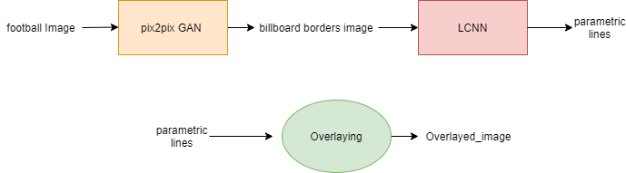
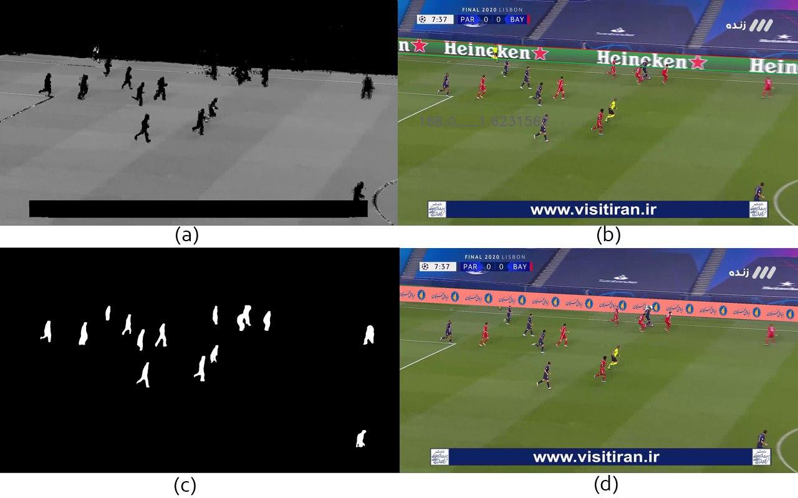

# Virtual advertising

Showing and advertising your products or services in any Virtual environment is known as virtual advertising. This kind of advertisement can be done also in football videos by overlaying billboards placed around the field. Almost all existing related products do this by their hardware tools which are placed in the stadium but we tried to do that by a single software. The input is a footbal video frame and the output is the overlayed video frame.

## Algorithm
This is done by three sub-modules:
1. A [pix2pix GAN](https://arxiv.org/abs/1611.07004) is trained for detection of billboard borders in a video frame.
2. [(LCNN)](https://arxiv.org/abs/1905.03246) :A network for fitting parametric lines to the ouput of the GAN.
3. Warping and overlaying an arbitrary advertising image to the points which GAN has found.

The overal architecture is displayed as below :

     
	Figure 1. Flowchart 

Results of each sub-module are displayed in the results section.  

## Demo Application
If you want to train  networks from scratch, Please Skip this section and go to the Training section.

To deploy the demo, run the following commands:
- change directory to  Vrtual advertisement Module Repository.
- If you do not have PyTorch, please see [the website](http://pytorch.org).
- Install Python dependencies: `pip install -r requirements.txt`

- For a single image:
- 
1. Download the trained GAN models from [this link](https://drive.google.com/uc?export=download&id=1KDIT5y6cmkK1x9vHOtMMtsB0H9yL9jJn) and put both files into the `./python_codes/LCNN_GAN/GAN/checkpoints/datasets/` directory
2. Download the trained LCNN model from [this link](https://drive.google.com/uc?export=download&id=1YLS4oyetw_fQaHm7xY_-4k7HMn-QOJkS) and put it into the `./python_codes/LCNN_GAN/logs/` directory
3. Change directory to the `LCNN_GAN/` directory 
4. Put dataset in the `./data/worldcup_raw/`directory or create your own dataset just like us and put it in the mentioned directory. (Incomplete)
5. Run `./dataset/wireframe.py --./data/worldcup_raw --./data/worldcup`  
6. Put your football images into `main_directory/images/` directory.
7. Run the demo: `python demo_image.py --advertising_image [address of advertising image what you want to overlay]`

The results will be saved in "main_directory/overlayed_images/" directory.

## Training

For training pix2pix GAN from scratch, you should read [this](https://github.com/phillipi/pix2pix):

The input is a footbal image and the ouput is billboard borders image. It must be trained with the Line dataset in datasets directory  or something like that which you can generate for yourself.

For training LCNN you should read their [github page](https://github.com/zhou13/lcnn).
The input is the GAN output and the ouput is parametric lines. It must be trained with the Line detection dataset in datasets directory  or something like that which you can generate for yourself.

## Some results

     
	Figure 2. sample output of Virtual Advertising module

